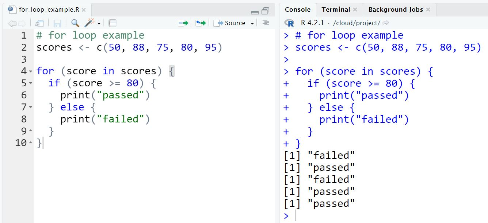

```{r setup, include=FALSE}
knitr::opts_chunk$set(echo = TRUE)
```

# R101 / Getting Started with R

------------------------------------------------------------------------

## **EP02 - Create and Remove Variables**

Create my R variables and removing said variables.

```{r : EP02 - Create and Remove Variables}
## create variables
income <- 50000
expense <- 30000
saving <- income - expense

## remove variable
rm(saving)

```

## **EP03 - Compare Values**

### **Comparison Operators**

เราสามารถเขียน comparison operators ต่อไปนี้เพื่อเปรียบเทียบสองฝั่งของสมการได้ใน R

-   `>`

-   `>=`

-   `<`

-   `<=`

-   `==` (equal)

-   `!=` (not equal)

🌵 Note - เราใช้เครื่องหมาย **double** equal signs `==` เพื่อเทียบสองฝั่งของสมการ ถ้าใช้ **single** equal sign เช่น `x = 5` จะเป็นการประกาศตัวแปร เพราะใน R เราสามารถสร้างตัวแปรได้สองแบบคือ `<-` หรือ `=`

```{r EP03 - Compare Values}
## compare values
1 + 1 == 2
2 * 2 <= 4
5 >= 10
5 - 2 != 3
10 < 2
10 > 2

## compare text and characters
"Hello" == "hello"
"Hello" == "Hello" ### R is case sensitive

```

## EP04 - Data Types

### **Data Types in R**

ความรู้พื้นฐานเกี่ยวกับ data types คือสำคัญขั้นสุดตอนเขียนโปรแกรม ภาษาคอมพิวเตอร์หลายๆภาษาจะ strict เรื่อง **data types** มากๆ ใน R ก็เช่นเดียวกัน โดย common data types ที่ data analyst เราต้องใช้งานเป็นประจำจะมีอยู่ 5 ประเภทคือ

-   `numeric`

-   `character`

-   `logical`

-   `factor` อันนี้คือตัวแปร categorical ในทางสถิติ

-   `date`

🌵 R มี package `lubridate` ที่ใช้จัดการ date ได้ง่ายมาก

```{r EP04 - Data Types}
## Data Types

### 1. numeric
age <- 32
print(age)
class(age)

### 2. character
my_name <- "Sutiwas Jitsopak"
my_university <- "Chulalongkorn University"
print(my_name)
print(my_university)
class(my_name); class(my_university)

### 3. logical
result <- 1 + 1 == 2
print(result)
class(result)

### 4. factor
animals <- c("Dog", "Cat", "Crocodile", "Bird")
class(animals)

animals <- factor(animals)
class(animals)

### 5. date
time_now <- Sys.time()
class(time_now)

```

## **EP05 - Convert Data Types**

```{r EP05 - Convert Data Types}
## Convert Data Types

## main functions
## as.numeric()
## as.character()
## as.logical()

x <- 100
class(x)

char_x <- as.character(x)
num_x <- as.numeric(x)

## logical: TRUE/FALSE
as.logical(0)
as.logical(1)
as.numeric(0)
as.numeric(1)
```

## EP06 - EP10 (Crucial Data types & Subsetting)

```{r EP06 - EP10 (Crucial Data types & Subsetting)}
## --------------------------------------------------------
## vector

1:10
11:25

## sequence generation
seq(from = 1, to = 100, by = 5)

## help file
help(seq)

## function c
friends <- c("David", "Marry", "Anna", "John", "William")
is_male <- c(TRUE, FALSE, FALSE, TRUE, TRUE)

## --------------------------------------------------------
## matrix

x <- 1:25
length(x)
dim(x) <- c(5,5)

m1 <- matrix(1:25, ncol=5)
m2 <- matrix(1:6, ncol=3, nrow=2, byrow = T)

## Element wise computation
m1 + 100
m2 * 10

## --------------------------------------------------------
## list

my_name <- "Ham"
my_friends <- c("Wan", "Eng", "Sue")
m3 <- matrix(1:25, ncol=5)
r_iscool <- TRUE

my_list <- list(item1 = my_name,
                item2 = my_friends,
                item3 = m3,
                item4 = r_iscool)
my_list$item1
my_list$item2
my_list$item3
my_list$item4

## --------------------------------------------------------
## Data Frames

friends <- c("Wan", "Erik", "Ashley", "Bee", "Toon")

Ages <- c(26, 27, 27, 28, 32)

locations <- c("New York",
               "London",
               "Tokyo",
               "Manchester",
               "New York")

movie_lover <- c(TRUE, TRUE, TRUE, FALSE, FALSE)

df <- data.frame(friends,
           Ages,
           locations,
           movie_lover)

View(df)

## create data frame from list
my_list <- list(friends = friends,
                ages = Ages,
                locations = locations,
                movie_lover = movie_lover)

data.frame(my_list)

## --------------------------------------------------------
## subset

friends[1:3]

friends[c(1, 3, 5)]

friends[4:5]

ages <- c(26, 27, 27, 28, 32)

View(df)
```

------------------------------------------------------------------------

# R102 / Control Flow and Function

## **Control Flow**

Control Flow คือหนึ่งใน building blocks ที่สำคัญของการเขียนโปรแกรม ใน R มี control flow สำคัญอยู่สามตัวคือ

1.  `if`

2.  `for`

3.  `while`

Note - เวลาเราพิมพ์ keyword `if` `for` `while` ใน script จะมี highlight syntax ให้เราด้วย

🌵 หน้าที่ของ **Control Flow** คือการควบคุมพฤติกรรมของโปรแกรมที่เราเขียน ตัวอย่างเช่น

`score <- 85`

`if (score >= 80) { print("passed") } else { print("failed") }`

ถ้าคะแนนสอบมากกว่าหรือเท่ากับ 80 คะแนน สอบผ่าน "passed" แต่ถ้าคะแนนไม่ถึงเกณฑ์คือสอบตก "failed"

เราเขียน `if` เพื่อกำหนดเส้นทาง (path) การทำงานของโปรแกรม

หรือถ้าเราเขียน `for` เราจะสามารถ loop ตัวแปรหรือ object ที่เราประกาศไว้ใน R ได้ เช่น การตัดเกรดคะแนนนักเรียน 5 คนในตัวแปร `scores`



## EP01 - IF 

🌵 การเขียนเงื่อนไข IF เป็นพื้นฐานของ computer program ทุกภาษาจะมีโครงสร้างการเขียนเหมือนกันเลย คือ condition, if TRUE, else FALSE

```{r EP01 - IF}
## control flow
## if else statement

score = readline( prompt = "Enter your score: ")
score = as.numeric(score);

if (score >= 80){
  print("Passed")
} else {
  print("Failed")
}
```

## **EP02 - ifelse()**

🌵 `ifelse()` syntax เขียนเหมือนกับ `=IF()` ใน Google Sheets/ Excel

`ifelse(condition, TRUE, FALSE)`

```{r EP02 - ifelse()}
ifelse(score >= 90, "Passed", ifelse(
  score >= 50, "OK", "Enroll Again"
))
```

## **EP03 - FOR**

```{r EP03 - FOR}
## for loop
mat <- matrix(rnorm(100), ncol = 5)

par(mfrow = c(2,3))

for (i in 1:5) {
  hist(mat[, i], main = paste("Column", i), xlab = "Values", col = "lightblue")
}
```

## **EP04 - WHILE**

🌵 Note - อย่าลืมอัพเดทตัวแปร `count` ที่เราใช้ใน `while` loop ไม่งั้นเราจะติดใน `infinite loop`

```{r EP04 - WHILE}
## while loop
while (score <= 90) {
  score <- score + 1
}
```

## **EP05 - Function**

```{r EP05 - Function}
## function: input -> f() -> output

x <- c(10, 20, 55, 77, 100)
sum(x)
mean(x)
sd(x)
```

## **EP06 - Create Our First Function**

🌵 R ใช้ keyword `function` ในการประกาศ function ใหม่

```{r EP06 - Create Our First Function}

name_age <- function(){
  name = readline(prompt = "Enter your name: ")
  age = readline(prompt = "Enter your age: ")
  age = as.integer(age)
  print( paste("Hello", name, "!! Your age is", age) )
}

name_age()
```

## **EP07 - Function Parameter & Argument**

🌵 คำศัพท์ที่เราใช้ในการเขียน `function` มีอยู่สองคำ (concept นี้ใช้ได้กับทุกภาษาเลย)

-   `parameter`

-   `argument`

**Parameter** คือชื่อ named input ที่เราใส่ใน function ส่วน **Argument** คือ actual value ที่เราใส่ไปใน parameter นั้นๆตอนเรารัน function

ตัวอย่างการเขียน parameter และ argument ใน R

`greeting <- function( name = "Toy" ) { print(paste("Hi!", name)) }`

-   name คือ parameter

-   "Toy" คือ argument

```{r EP07 - Function Parameter & Argument}
greeting_name <- function(name = "Ham", age = 22) {
  print(paste("Hello!", name))
  print(paste("Age:", age))
}

greeting_name()
```

## **EP08 - Function Kata**

#### Practice Practice Practice

🌵 มาลองฝึกเขียน 3 functions ใน R

-   `add_two_nums()`

-   `cube()`

-   `count_ball()`

```{r EP08 - Function Kata}
# add_two_nums() function
add_two_nums <- function(val1, val2) {
  val1 + val2
}

# cube() function
cube <- function(base, power=3) {
  return(base ** power)
}

# count_ball() function
balls <- c("red", "red", "blue", "green",
           "green", "green", "green", "red")

count_ball <- function(balls, color) {
  sum(balls == color)
}

count_ball(balls, "red")
count_ball(balls, "blue")
count_ball(balls, "green")
```

## **EP09 - Looping over a dataframe**

### **Refactoring Your Code**

🌵 Refactor คือการปรับรูปแบบการเขียนโค้ดของเรา (re-structuring code) ให้อ่านง่ายขึ้น แสดงผลดีขึ้น หรือรันได้เร็วขึ้น แต่ผลลัพธ์ยังออกมาเหมือนเดิม

**Tip** - เวลาเราอยากจะดึงคอลัมน์จาก dataframe ใน R สามารถเขียนได้หลายแบบ สมมติเราอยากจะดึงคอลัมน์ชื่อ `"col_name"`, column index = 5 ใน dataframe ตัวอย่าง syntax ทั้งสามแบบนี้ได้ผลลัพธ์เหมือนกันเลย

-   `data$col_name`

-   `data[["col_name"]]`

-   `data[[5]]`

💾 การใช้ `[]` กับ `[[]]` เวลาดึงข้อมูลออกมาจาก dataframe จะต่างกันที่ data type ที่มัน return กลับมา

```{r EP09 - Looping over a dataframe}
# refactor our code for more readability
cal_mean_by_col <- function(df) {
  col_names <- names(df)
  
  # we use [[]] to extract column as vector
  for (i in 1:ncol(df)) {
    avg_col <- mean(df[[i]]) 
    print(paste(col_names[i], ":", avg_col))
  }
}

# test our code with mtcars
cal_mean_by_col(mtcars)
```

## **EP10 - apply() function**

🌵 ใน R มีฟังก์ชัน `apply()` ที่เราใช้แทนการเขียน `loop` ได้ทั้ง columns, rows สะดวกมาก

```{r EP10 - apply() function}
# apply function: MARGIN = (1: By rows, 2: By columns)
avg_by_row_mtcars <- apply(mtcars, MARGIN = 1, mean)
avg_by_row_mtcars[1:10]
```

------------------------------------------------------------------------

# R103 / Working with Data
